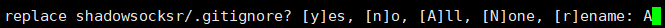
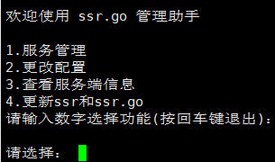
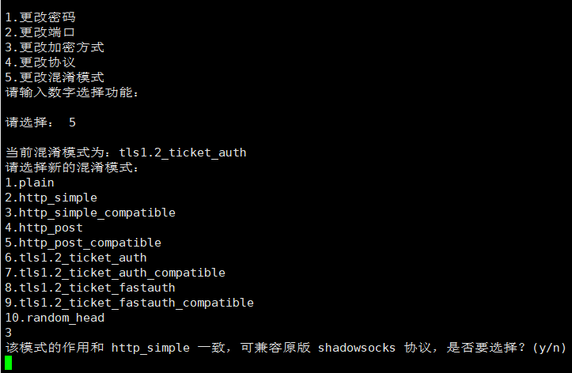
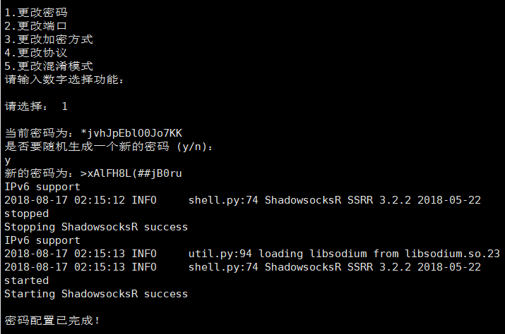

<!-- anchor area -->

<a href="#Introduce">简介（Introduce）</a></h1>

     <ul>
     <li><a href="#Preface">前言（Preface）</a></li>
     <li><a href="#Install">安装（Install）</a></li>
     <li><a href="#Spec">特性（Specs）</a></li>
     <li><a href="#Sample">使用示例（Sample）</a></li>
     <li><a href="#Request">外部要求（Request）</a></li>
     <li><a href="#Updates">更新日志（Updates）</a></li>
     <li><a href="#THX">致谢（Thanks）</a></li>
     </ul>
<!-- anchor area -->

<h1><a id="Introduce">简介（Introduce）</a></h1>

全新面貌的SSR.Go，现已启航！她是一款可突破中国互联网审查的强力代理工具。使用本工具，你可方便地调整、管理 ShadowSocksRR 的配置和运行。以下是本工具的说明，你可以点击相应的跳转链接，寻找你感兴趣或对你而言感觉重要的部分。

ShadowSocksRR powered by SSR.Go is a robust proxy which can breakthrough Chinese internet censorship. You can use it easily to configurate and manage ShadowSocksRR program and keep it running. Just click urls which interested or important for you and they construct to descriptions of this tool.

 

<h2><a id="Preface">前言（Preface）</a></h2>

面对威权压迫，你是甘为一辈子懦夫，还是坚定勇气，试着改变这个污浊不堪的世界？于此，虽千万人吾往矣。全新的shadowsocksR管理助手——SSR.Go，现已问世。长夜漫漫，父说，擦亮双眸的你，需要一道光明，使者便从了他的意，把光明给带来了。

I'm not only hate GFW, but also fighting with it. No matter from where, human has natural rights to access to uncensored information to escape from authoritarianism and oppression.

 

<h2><a id="Install">安装（Install）</a></h2>

如果你的 VPS 刚刚新装过系统，<b>强烈建议你输入以下命令，重启并再次连接</b>，否则安装的过程中，会出现各种各样未知的问题。

I really recommend you to restart your VPS when your installed system just now and you need to reconnect it manual in order to avoid lots of unknown mistakes.

<pre><code>reboot</code></pre>

然后开始安装此工具（简体中文版）。

<pre><code>bash -c "$(curl -fsSL https://git.io/fNpuL)"</code></pre>

And then you can install it ( An English version ).

<pre><code>bash -c "$(curl -fsSL https://git.io/fAUCt)"</code></pre>

需要注意的是，<b>简体中文版 SSR.Go 和英文版 SSR.Go 只能同时使用其中的一个，不可共存。</b>

You need to consider that <b>only one version of simplified Chinese or English version of SSR.Go can run on your environment</b>.

老用户升级过程中，会出现以下提示，这是由于旧的安装脚本，先将主程序解压到本地 /usr/local/目录中，再将 shadowsocksr 目录中的单用户版 ssr 程序目录：shadowsocks 移动到上一级目录后，没有清理存储在 shadowsocksr 目录中的 gitclone 缓存导致的，你只需要输入大写的 A ，继续即可。新版本的脚本已对这一问题做了调整。

Old users should notice that the following reminds because the former installation unzipped "manyusr.zip" to /usr/local direction created a "shadowsocksr" folder and then shell moved ssr single user's main program which included in many-user(shadowsocksr) to /usr/local, so this folder contains two folders: "shadowsocks" and "shadowsocksr". Cache belongs to gitclone had been storaged in shadowsocksr before so when it updates, Git will ask you whether replace shadowsocksr/.gitingnore. Just press "A: will be okay.

 

<h2><a id="Spec">特性（Specs）</a></h2>

1. 一键部署 ShadowSocksR 和 SSR.Go，无需额外设置运行环境

Once bash command, ShadowSocksR with it's manager————SSR.Go and included operating environment will be installed. 

 

2. 在你的vps里的任意位置，输入 ssr 即可启动，对话框式操作界面，方便快捷

It's so convince that you just need input "ssr" to run it everywhere in your linux system then dialog operation will lead you to config with ShadowSocksR.

 

3. <b>默认采用最新版实验型协议————akarrin 系列，抗封锁能力较强，目前只有 Windows 客户端支持，手机/路由器均不能用，但仍然强烈建议使用</b>，下载链接：<a href="https://github.com/leitbogioro/ShadowsocksRR-Install/files/2127044/ShadowsocksR-win-4.9.0.zip-dev.zip">ShadowsocksR-win-4.9.0.zip-dev</a>。

Use akarrin series protocol as ShadowSocksR's config, <b>I recommend this protocol because it has strong anti-blocking ability but it can only supported on Windows and doesn't work on smartphone or wireless-router.</b>Press it to download: <a href="https://github.com/leitbogioro/ShadowsocksRR-Install/files/2127044/ShadowsocksR-win-4.9.0.zip-dev.zip">ShadowsocksR-win-4.9.0.zip-dev</a>.

 

4. <b>可快速直观地生成、查看客户端配置信息，无需费劲巴拉地手动修改 config.json 文件。</b>

<b>You can quickly and intuitively generate, look up client configurate information instead of manually modifiy a fuckin "config.json" which you don't have any patient to deal with!</b>

 

5. <b>专为 CentOS 6/7 解决了复杂的二维码生成组件配置环境（你知道我 TM 花了多大劲吗！）</b>，你可以在 CentOS 系统上愉快地使用它们。

<b>Especially complained a complex compatibility problem about qrcode generation library on CentOS 6/7（do you know how much fuckin difficult I had suffered!）</b>, now you can have a perfect experience on CentOS.

 

6. 有关新特性————“重定向”参数的一些说明：

设置重定向，意味着<b>当来访的请求不符合 ShadowSocksR 数据包类型的时候，ShadowSocksR 会自动将该请求重定向到本机的或其他域的空间</b>。

典型的配置，是将外界访问本机 80、443 端口且不符合以上规则的请求，全部重定向到本机的某个端口，然后由 Apache、Nginx 或 Caddy 来监听该端口，实现 ShadowSocksR 在正常网站背后的隐藏或反代功能。

由于无法完全确定您使用了何种 Web 服务器，何种配置，本功能仅对 ShadowSocksR 配置文件中的重定向参数进行设置，本来有引入一键安装 Caddy 并申请加密证书的计划。但 Web 服务器的用途广泛，配置、需求不一，为了尽量避免对您的生产环境造成干扰，造成配置絮乱，烦请您后续还要手动在 Web 服务器里做好相应的监听设置，敬请谅解

本脚本除了在安装、卸载功能里，添加可供 ShadowSocksR 所有正常功能运行的全部依赖以外，在日常配置的过程中，仅对 ShadowSocksR 的配置文件进行修改，不会干涉您运行环境中其他组件的组织和运行。

设置好重定向功能后，ShadowSocksR 的主通信端口会被还原为 443，若曾用过本脚本设置重定向，取消配置后主端口仍为 443。

Once after configuring redirection, Request datatype ingress to server which don't correspond with ShadowSocksR will be redirected to localhost or another domain automatically.

A default configuration is setting all ingress request by 80/443 port redirect to localhost by some-port which you have configurated and then let a web server(Apache, Nginx or Caddy) to listen to it so you can achieve ShadowSocksR hide behind in an normal website or set up reverse proxy.

Because this shell can't distinguish that which web server you had installed and which configuration you had set, I originally have a plan to provide caddy's one-key installation and apply https certificate at the begging. But I found that there are so many different web servers and various configurations, according to cause less consequence to your normal production environment or do not disturb your formal configuration. I'm sorry to explain and hope you to config Nginx listen to somewhere redirected by ShadowSocksR for example manually.

My aims to write this shell is to set up ShadowSocksR's config and as far as possible to reduce any accident(regardless of profits or consequence) influence to your execute environment with many important componets.

 

<h2><a id="Sample">使用示例（Sample）</a></h2>

 
 

<h2><a id="Request">外部要求（Request）</a></h2>

1. 一台运行以下任意Linux系统的VPS：

A linux virtual private server which run the following system:

<ul>
<li>Debian 7+(8/9)</li> 
<li>Ubuntu 14</li>
<li><b>Ubuntu 16（推荐 Recommend）</b></li>
<li>Ubuntu 18</li>
<li>CentOS 6/7</li>
</ul>
 

2. ssh连接工具（推荐：<a href="https://www.netsarang.com/products/xsh_overview.html">Xshell</a> 或 <a href="https://www.chiark.greenend.org.uk/~sgtatham/putty/latest.html">Putty</a>）

A ssh connect tool（Recommend <a href="https://www.netsarang.com/products/xsh_overview.html">Xshell</a> or <a href="https://www.chiark.greenend.org.uk/~sgtatham/putty/latest.html">Putty</a>）

 

3. 部分系统在执行安装命令前，需要安装curl组件，对应命令如下：

Some environment need to install curl before download and install SSR.Go, you should do:

Cent OS

<pre><code>yum -y install curl</code></pre>

Debian/Ubuntu

<pre><code>apt-get install curl -y</code></pre>
 

<h2><a id="Updates">更新日志（Updates）：</a></h2>
<ul>
<li>检测是否已有配置文件，有则在升级前备份，并在升级后恢复，以防程序升级后原有配置被重写造成错乱。(2019.11.7)</li>

Check if the configuration existes, installer will backup it before update and restore it after update instead of configuration will be rewrited by update program and causes confusion.(2019.11.7)

<li>安装程序逻辑错误修复。(2019.11.6)</li>

Fix installer illogical bugs.(2019.11.6)

<li>经测试，如果长时间多终端一起使用，该程序的日志文件体积会快速膨胀并大量占用主机磁盘空间，故在维护组件里加入每周清空程序日志的功能。(2019.11.6)</li>

If there are many devices connect to one ShadowSocksR server for a long time, the log on server will occupy an inconceivable disk space. So I add an function about log purge in maintain component which executes weekly.(2019.11.6)

<li>将计划任务中的每周重启一次任务整合至维护组件内运行。(2019.11.5)</li>

Put restart command into a component calls 'maintain' and it will execute weekly.(2019.11.5)

<li>Withdraw config UUID function.(2019.6.3)</li>

撤销修改 UUID 功能。(2019.6.3)

<li>Update config UUID.(2019.6.2)</li>

更新自定义 UUID 的功能。(2019.6.2)
    
<li>修复了因判断逻辑错误，CentOS 无法正确安装的问题。（2019.4.10）</li>

Fix a bug that can't install on CentOS.(2019.4.10)

<li>修复了通过 https 网站调用 IP 地址时脚本出错的问题。（2019.4.2）</li>

Fix a bug that when getting IP address from a https website, there will go a wrong with script.(2019.4.2)

<li>更新 libsodium 组件至 1.0.17。（2019.3.25）</li>

Update libsodium componet to 1.0.17.(2019.3.25)

<li>添加检测阿里云进程的逻辑，一旦您尝试在预装了阿里云监控服务的环境中安装，安装会立即退出。（2018.12.21）</li>

Add a function to doubt whether your environment has installed Aliyun/AlibabaCloud's monitor process and once these has been detected, installation of ShadowSocksR will been suspend.(2018.12.21)

<li>添加重定向功能的英文描述（2018.12.20）</li>

Add English explanation about redirection(2018.12.20).

<li>修复设置重定向参数后，主端口为设置成 443 的问题。（2018.12.17）</li>

Repair program doesn't set main port with 443 after setting redirection.(2018.12.17)

<li>添加安装后删除 /usr/local/shadowsocksr 多用户版冗余目录的逻辑。（2018.12.16）</li>

Add a logic about remove direction -- "/usr/local/shadowsocksr", it is not useful for ShadowSocksR single user.

<li>增加卸载 SSR.Go 和 ShadowSocksR 功能，修改 ssrmain.sh 脚本的卸载逻辑（2018.12.16）</li>

Add an uninstallation of SSR.Go and ShadowSocksR, change uninstallation strategy in shell ssrmain.sh.(2018.12.16)

<li>优化 ssr 主程序结构。（2018.12.16）</li>

Optimize main construction of ssr's main program.(2018.12.16)

<li>加入设置重定向参数的功能。（2018.12.15）</li>

Add a function about configurate parameters of redirect.(2018.12.15)

<li>优化脚本交互逻辑，使用某级列表下的功能后仍将返回到某级列表。（2018.9.2）</li>

Optimized script interaction logic, When you explor some function in one list which you will come back this list.(2018.9.2)

<li>使 CentOS 7 上的二维码生成功能可用。（2018.8.27）</li>

Make a perfect availability about generate qrcode on CentOS 7.(2018.8.27)
  
<li>使 CentOS 6 上的二维码生成功能可用。（2018.8.26）</li>

Make a perfect availability about generate qrcode on CentOS 6.(2018.8.26)

<li>增加生成二维码功能，因 Cent OS 6 自带的 python 版本与 qrcode 组件的运行环境不兼容，故暂时功能异常，正在修复中。（2018.8.24）</li>

Add a function about generate client qrcode, but it depends on qrcode pip kit for python2.7 and it doesn't complain with python2.6 in Cent OS 6 so I'm fixing it.

<li>修复了阿里云、腾讯云、Azure、Amazon、Google Cloud Platform等自带安全组规则的vps获取 IP 地址会变成内网地址的问题。（2018.8.24）</li>

Fix a problem about getting external network IP address but it causes to local IP address in vps from AlibabaCloud, TencentCloud, Azure, Amazon, Google Cloud Platform etc which has it's own security group rule.(2018.8.24)

<li>更新获取服务端 IP 地址逻辑。（2018.8.23）</li>

Update get server IP address logic.(2018.8.23)

<li>修正更新 ssr 和 SSR.Go 功能无效的问题。（2018.8.22）</li>

Fix an invalid mistake about updating ssr and SSR.Go.(2018.8.22)

<li>优化安装流程（2018.8.22）</li>

Optimize installation process.(2018.8.22)

<li>修复在 CentOS 6/7 上运行错误的<a href="https://github.com/leitbogioro/SSR.Go/issues/9#issue-352075641">问题</a>，详情请<a href="https://github.com/leitbogioro/SSR.Go/issues/9#issuecomment-415026731">参见</a>。（2018.8.22）</li>

Fix an error about running with <a href="https://github.com/leitbogioro/SSR.Go/issues/9#issue-352075641">mistakes</a> on CentOS 6/7, for more details, please <a href="https://github.com/leitbogioro/SSR.Go/issues/9#issuecomment-415026731">view</a>.(2018.8.22)

<li>新增中英文切换功能（2018.8.21）</li>

Add a function about switch a version between simplified Chinese and English each other.(2018.8.21)

<li>正式推出英文版。（2018.8.21）</li>

An English version of SSR.Go is released.(2018.8.21)

<li>添加“首次进入后需要重启才能顺利安装”的描述。（2018.8.20）</li>

Add notice about "You need to reboot your system after installed system before install SSR.Go."(2018.8.20)

<li>修复了加密依赖“libsodium”的安装策略。（2018.8.19）</li>

Fix install strategy about "libsodim" encryption component.(2018.8.19)

<li>修复了安装过程中，ShadowSocksR主程序————“manyuser.zip”文件下载错误的问题（2018.8.19）</li>

Fix a problem about during install, main ShadowSocksR source code————"manyuser.zip" can't download.(2018.8.19)

<li>修改增添端口策略，如果 iptables 里已经有了 SSR 运行的端口，则不重复添加，以免添加大量冗余规则。（2018.8.19）</li>

Change add ports tactics, if there are same ports which SSR running need in iptables it won't add rules indeed to avoid mass redundancy.(2018.8.19)

<li>新增将 SSR 运行端口添加到系统防火墙功能。（2018.8.19）</li>

Expand a new function for add iptables port rules about port of SSR used.(2018.8.19)

<li>修改安装后提示“输入 srr 并回车使用即可使用”的错误描述（2018.8.18）</li>

Change wrong prompt after installed(2018.8.18)

<li>初版完成。（2018.8.17）</li>

First release is completed.(2018.8.17)

<li>增添文档描述。（2018.8.17）</li>

Add documents and describes.(2018.8.17)

</ul>
 

<h2><a id="THX">致谢（Thanks）：</a></h2>

tracyone：<a href="https://github.com/tracyone/v2ray.fun">v2ray.fun</a>

v2ray.fun 原作者：<a href="https://github.com/YLWS-4617">雨落无声</a>

ShadowSocksR 原作者：<a href="https://github.com/breakwa11">破娃酱</a>

ShadowSocksRR 现维护者<a href="https://github.com/Akkariiin"> Akarrin </a>和其项目主页：<a href="https://github.com/shadowsocksrr">ShadowSocksRR</a>

ShadowsocksR 一键安装包作者：<a href="https://teddysun.com">TeddySun</a>

 

暂不接受任何捐助

